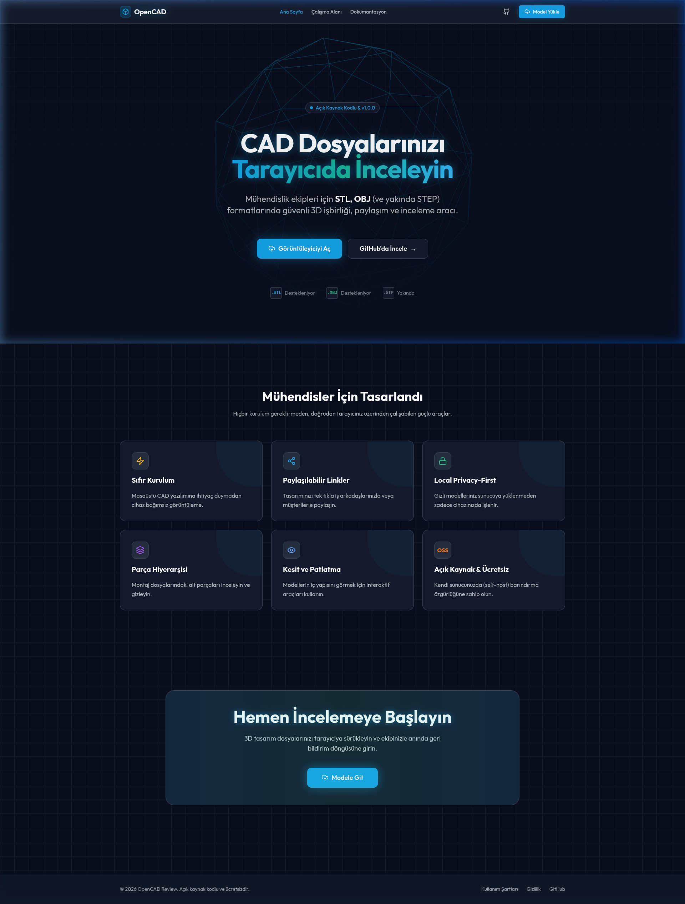
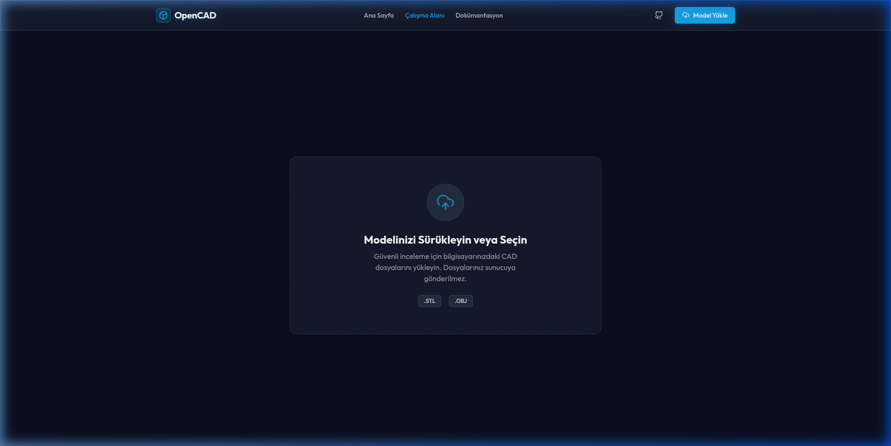

# OpenCAD Review (OSS) 🧊

> Mühendislik ekipleri için tarayıcı üzerinde çalışan, kurulum gerektirmeyen **güvenli**, **açık kaynak kodlu** 3D model (CAD) görüntüleyici ve işbirliği aracı.



## 📖 Proje Hakkında

Mekanik tasarım, üretim ve mühendislik ekiplerinin en büyük dertlerinden biri olan CAD dosyası (STL, OBJ, STEP vb.) görüntüleme ve üzerinde geri bildirim bırakma sürecini tamamen tarayıcı ortamına taşıyoruz.

Ağır ve pahalı masaüstü yazılımlara ihtiyaç duymadan, dosyalarınızı tarayıcıya sürükleyip bırakarak anında inceleyin, parça ayrıştırma yapın ve ekip arkadaşlarınızla modeller üzerinde notlar (pin) bırakın. 

Proje **Tamamen Açık Kaynak Kodludur (OSS)**. Hassas ve gizli projelerinizi kendi sunucunuzda *self-host* ederek %100 gizlilik ve güvenlik sağlayabilirsiniz. Local Conversion modu ile dosyalarınız asla üçüncü parti sunuculara yüklenmez.



## ✨ Öne Çıkan Özellikler

- **Tarayıcıda 3D Görüntüleme**: WebGL ve Three.js altyapısı ile yüksek performanslı render.
- **Tak & Çalıştır Formats**: Anında `.stl` ve `.obj` desteği. Sürükle-bırak yöntemiyle saniyeler içinde parse edilir. (STEP desteği için çalışmalar sürüyor).
- **Premium Arayüz & UX**: Karanlık mod ("cyberpunk grid"), cam paneller (glassmorphism) ve animasyonlu pürüzsüz geçişlerle donatılmış mühendis odaklı minimal arayüz.
- **İnteraktif Araçlar**: Tel Kafes (Wireframe) görünümü, otomatik döndürme, ve model hiyerarşisi ağacı.
- **Local Privacy-First**: Tarayıcıda (istemci tarafında) modeller işlenir. Sunucuya ham CAD dosyalarınız **asla** gönderilmez. (Local mode).
- **Yorumlar & İşbirliği (Geliştiriliyor)**: Tasarım üzerinde tıklanılan noktaya pin/not bırakma ve ekip arkadaşlarıyla koordinasyon (MVP sürümünde sadece arayüz mocking'i vardır).

## 🚀 Başlangıç & Kurulum (Geliştirici)

Proje modern Node.js ve React mimarisi kullanılarak oluşturulmuştur. Kendi bilgisayarınızda (veya sunucunuzda) çalıştırmak için aşağıdaki adımları takip edebilirsiniz:

### Ön Gereksinimler
- Node.js (v18 veya daha yeni bir sürüm)
- npm veya yarn

### Kurulum Adımları
1. Repoyu bilgisayarınıza klonlayın:
```bash
git clone https://github.com/topalemirfaruk/OpenCAD-Review.git
```
2. Proje dizinine girin:
```bash
cd OpenCAD-Review
```
3. Gerekli kütüphane ve modülleri yükleyin:
```bash
npm install
```
4. Geliştirme (development) sunucusunu başlatın:
```bash
npm run dev
```
5. Tarayıcınızdan `http://localhost:3000` adresine giderek OpenCAD Review dünyasına giriş yapın!

## 🛠 Kullanılan Teknolojiler

- **[Next.js 14](https://nextjs.org/)**: React tabanlı modern web iskeleti ve App Router mimarisi.
- **[Three.js](https://threejs.org/) & [@react-three/fiber](https://docs.pmnd.rs/react-three-fiber/getting-started/introduction)**: Yüksek performanslı, deklaratif 3D grafik render motoru.
- **[Tailwind CSS](https://tailwindcss.com/)**: Özelleştirilmiş "Premium Dark" estetik için yardımcı CSS framework'ü.
- **[Framer Motion](https://www.framer.com/motion/)**: Akıcı hover, enter/exit animasyonları ve sayfa geçişleri.
- **[Zustand](https://zustand-demo.pmnd.rs/)**: Minimal ama güçlü, Redux alternatifi global state yönetim aracı.
- **[Lucide React](https://lucide.dev/)**: Net, modern ve okunaklı SVG arayüz ikonları.

## 🤝 Katkıda Bulunma

Bu projenin gelişmesi için topluluk desteğine ihtiyacımız var! Hataları bildirmek (Issues), yeni özellikler önermek veya kod katkısında bulunmak (Pull Request) isterseniz lütfen GitHub reposu üzerinden etkileşime geçin.

## 📜 Lisans

Bu proje, açık kaynak ideolojisine sıkı sıkıya bağlıdır ve herkesin ücretsiz, şeffaf bir şekilde kullanabilmesini destekler. Projenin açık kaynak yapısı devam edecektir. 

---
*Tasarlanan sistemler her zaman daha iyi olabilir. İnceleyin, yorumlayın ve inşa etmeye devam edin!*
